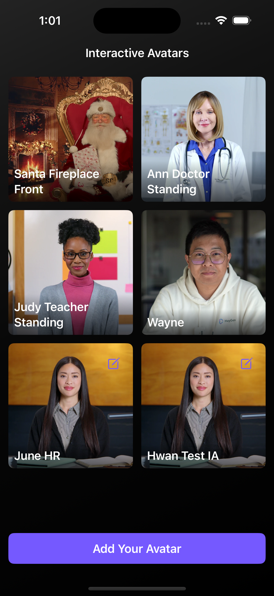
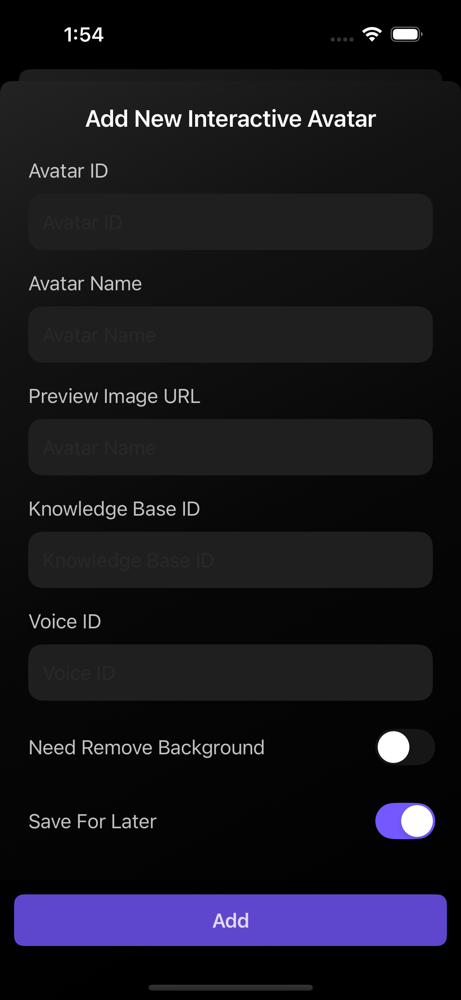
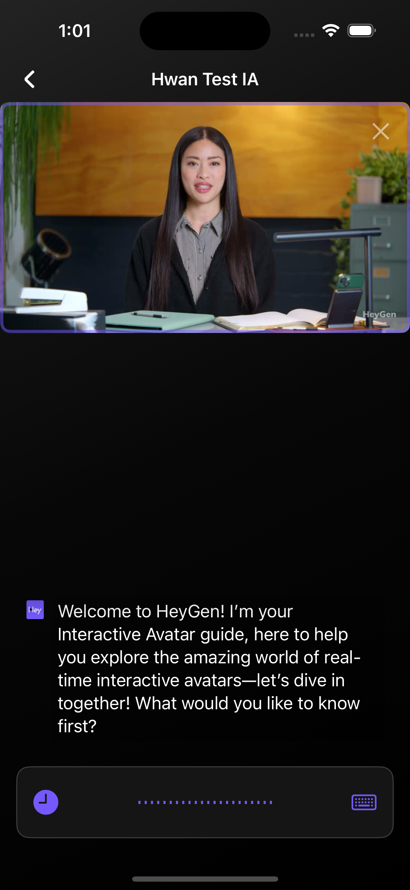
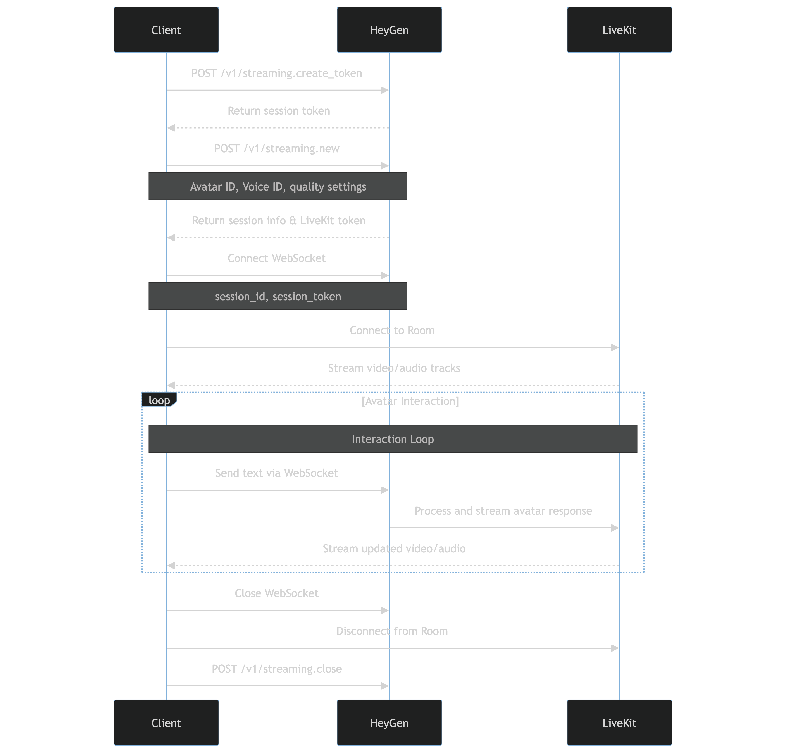

# interactive-avatar-swiftui

| Avatar List | Add Avatar | Chat |
| --- | --- | --- |
|  |  |  |

HeyGen's [Streaming API](https://docs.heygen.com/reference/new-session) allows developers to seamlessly integrate dynamic Interactive Avatars into their applications for immersive user experiences. With this API, you can display an Interactive Avatar in a real-time setting to create virtual assistants, training simulations, and more, utilizing low-latency communication between users and Interactive Avatars. In this demo, we will how the feature runs on the native iOS project (SwiftUI).

## Prerequisites
1. API Token from HeyGen
2. Basic understanding of iOS development
3. Basic understanding of [LiveKit SDK](https://github.com/livekit/client-sdk-swift)

## Project Setup
1. Download or clone the repo
2. Open the project `InteractiveAvatarDemo.xcodeproj`
3. Copy and paste your API Key to `static let apiKey: String = "YOUR_API_KEY"` in `InteractiveAvatarDemo/Api/ApiConfig.swift`
4. Run on the simulator or your device (Might need to wait until the Swift Packages is resovled)

## System Flow

## 3rd Party Libraries (Swift Packages)
1. https://github.com/Alamofire/Alamofire
2. https://github.com/SDWebImage/SDWebImageSwiftUI.git
3. https://github.com/livekit/client-sdk-swift

## References
1. https://docs.heygen.com/docs/streaming-api-integration-with-livekit-v2
